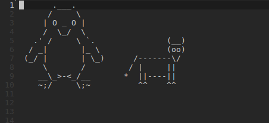

VIM-Schlepp
===========


Vim plugin to allow the movement of lines (or blocks) of text around easily.
Inspired by Damian Conway's DragVisuals from his
[More Instantly Better Vim](http://programming.oreilly.com/2013/10/more-instantly-better-vim.html)

The big difference between this and dragvisuals is that schlepp is much faster
when working over large selections of text, has more features, more
configurable, and hopefully has fewer gotchas.

What it Does
============
Schlepp lets you move a highlighted (visual mode) section of text around,
respecting other text around it.

Block and Line Selections work now.

Schlepp also lets you duplicate selections of text

Additionally run for more info
```
:help schlepp
```

Setup
=====

Installation
------------

* NeoBundle

    Add to vimrc
    ```viml
    NeoBundle 'zirrostig/vim-schlepp'
    ```
    Then run
    ```
    vim +NeoBundleCheck +qall
    ```

* Pathogen

    If you use submodules you probably don't need my help.
    ```
    git clone https://github.com/zirrostig/vim-schlepp.git ~/.vim/bundle/vim-schlepp
    ```

* Vundle

    Add to vimrc
    ```viml
    Bundle 'zirrostig/vim-schlepp'
    ```
    Then run
    ```
    vim +PluginInstall +qall
    ```

* No plugin management
    * Get some plugin management (Recommend NeoBundle)
    * OR
    Place the files in this repo into your ~/.vim maintaining the directory
    structure in this repo. Start up vim and run ':helptags doc'. Make sure it
    works


Movement
--------
Add the following mappings to your vimrc, feel free to change from using the
arrows to something more to your vim usage.

```viml
vmap <unique> <up>    <Plug>SchleppUp
vmap <unique> <down>  <Plug>SchleppDown
vmap <unique> <left>  <Plug>SchleppLeft
vmap <unique> <right> <Plug>SchleppRight
```

When moving text left, Schlepp by default does not allow you to move left if any
text is all the way left.
To allow the 'Squishing' of text add this line to your vimrc
```viml
let g:Schlepp#allowSquishingLines = 1
let g:Schlepp#allowSquishingBlock = 1
```

To disable trailing whitespace removal on block move
```viml
let g:Schlepp#trimWS = 0
```

Schlepp can also reindent code as it moves. Any of these work
* SchleppUp with reindentation is SchleppIndentUp
* SchleppDown with reindentation is SchleppIndentDown
* let g:Schlepp#reindent = 1
* map to the toggle function (below) - This is how I like to use it
```viml
vmap <unique> i <Plug>SchleppToggleReindent
```

And if you have GVIM (or a fancy terminal?) this should work well.
```viml
vmap <unique> <S-up>   <Plug>SchleppIndentUp
vmap <unique> <S-down> <Plug>SchleppIndentDown
```

Duplication
-----------
Some suggested mappings
```viml
vmap <unique> D <Plug>SchleppDup
```
or if you want fine grained control
```viml
vmap <unique> Dk <Plug>SchleppDupUp
vmap <unique> Dj <Plug>SchleppDupDown
vmap <unique> Dh <Plug>SchleppDupLeft
vmap <unique> Dl <Plug>SchleppDupRight
```
or set the default direction for SchleppDup
* DupLines can be "up" or "down"
* DupBlock can be "up", "down", "left", or "right"
* shown below are the defaults
```viml
let g:Schlepp#dupLinesDir = "down"
let g:Schlepp#dupBlockDir = "right"
```

To enable trailing whitespace removal on block duplication
```viml
let g:Schlepp#dupTrimWS = 1
```

Known Issues
============
* See GitHub Issue Tracker
* This README is lacking in cool useful gifs of Schlepp in action. - Someday
